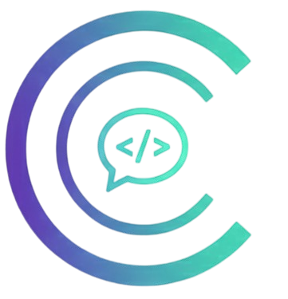

  
# 👋 Hi, I'm Vaibhav Sharma

### Full Stack Developer | Software Engineer | DSA Enthusiast

# 🌐 Socials:

---

##  About Me

- ⚡ **B.Tech in Electronics and Communication Engineering** at **IIIT Una** (CGPA: 8.55)
- ⚡ **Full Stack Developer** at **YesCity** - Leading tech team and building scalable travel platforms
- ⚡ **10+ months of industry experience** in building production-ready applications
- ⚡ **DSA Enthusiast** - Solved 600+ problems on LeetCode & 200+ on Coding Ninjas (Level 7)
- ⚡ Currently building **real-time collaboration tools** and **AI-powered applications**
- ⚡ Based in **Himachal Pradesh, India**

---

##  Professional Experience

<table>
<tr>
<td width="75%">

###  YesCity Full Stack Developer & Tech Team Lead (6+ months)
  🚀 Started as Full Stack Developer Intern & currently leading YesCity tech team
  
       **[YesCity](https://yescity.in)** - *Travel Assistance Platform*

**Key Contributions:**
- ⚡Led development of scalable travel platform using **Next.js 13+**, **MongoDB**, and **Firebase**
- ⚡Integrated RAG-based AI chatbot for personalized travel recommendations
- ⚡Built real-time group chat (Connect) and P2P chat (BuddyConnect) using **Pusher**
- ⚡Developed Analytics Dashboard for tracking user engagement and platform metrics
- ⚡Managing tech team, conducting code reviews, and ensuring scalable architecture

**Impact:**
- Transitioned from Developer to Tech Team Lead
- Implemented secure Firebase (OTP) and JWT authentication
- Delivered production-ready features with 99%+ uptime

</td>
<td width="25%" align="center">

  

<table style="border: 2px solid #2196F3; border-radius: 8px; padding: 15px; background: linear-gradient(135deg, #f8f9fa 0%, #e3f2fd 100%);">
<tr>
<td align="center">
<strong style="font-size: 15px; color: #1565C0;">Contributing</strong> 
6+ months 
Aug 2024 - Present  
<em style="color: #FF9800; font-size: 14px; font-weight: bold;">Currently: Tech Team Lead</em>  

</td>
</tr>
</table>

</td>
</tr>
</table>

---

## 💻 Tech Stack

🔤 Languages
<table> <tr> <td align="center" width="96">   C </td> <td align="center" width="96">   C++ </td> <td align="center" width="96">   JavaScript </td> <td align="center" width="96">   TypeScript </td> <td align="center" width="96">   Python </td> <td align="center" width="96">   SQL </td> </tr> </table>

🎨 Frontend
<table> <tr> <td align="center" width="96">   React </td> <td align="center" width="96">   Next.js </td> <td align="center" width="96">   Tailwind </td> <td align="center" width="96">   Bootstrap </td> </tr> </table>

⚙️ Backend
<table> <tr> <td align="center" width="96">   Node.js </td> <td align="center" width="96">   Express </td> <td align="center" width="96">
  
   Socket.IO
</td>
 </tr> </table>

🗄️ Database & Cloud
<table> <tr> <td align="center" width="96">   MongoDB </td> <td align="center" width="96">   Firebase </td> <td align="center" width="96">
  
   Cloudinary
</td>
 </tr> </table>

🛠️ Tools & Technologies
<table> <tr> <td align="center" width="96">   Git </td> <td align="center" width="96">   GitHub </td> <td align="center" width="96">   Postman </td> <td align="center" width="96">   Vercel </td>  <td align="center" width="96">
     Figma </td>
  <td align="center" width="96">
  
   Eraser
</td>

</tr> </table>

---

## 🌟 Featured Projects

<table>
<tr>
<td width="60%">

### 🛍️ TrueSeller
**Connecting Local Sellers to Online Buyers**

- ⚡ Full-stack **MERN** platform enabling local shopkeepers to sell products online
- ⚡ Implemented **JWT authentication**, secure payment gateway, and **Cloudinary** integration
- ⚡ Built buyer interface with state-wise product exploration, COD & online payment options

**Tech Stack:** React.js, Node.js, Express.js, MongoDB, JWT, Cloudinary

</td>
<td width="20%" align="center">

</td>
</tr>
</table>

---

<table>
<tr>
<td width="60%">

### 💬 CodChat
**Real-time Project Collaboration Platform**

- ⚡ Real-time collaborative platform for developers using **Socket.io**
- ⚡ Integrated **OpenAI API** for AI-powered code generation, debugging, and problem-solving
- ⚡ Built project rooms with chat, collaborator management, and session persistence

**Tech Stack:** MERN Stack, Socket.io, OpenAI API, JWT

</td>
<td width="20%" align="center">

<!--    -->

</td>
</tr>
</table>

---

<table>
<tr>
<td width="60%">

### 🎫 JustScan
**Smart Entry Management System**

- ⚡ Automated entry system using **Tesseract.js OCR** to extract data from ID cards
- ⚡ Secure authentication with **Google OAuth** (Passport.js)
- ⚡ Auto-populated entry logs with role-based access control

**Tech Stack:** Node.js, Express.js, MongoDB, Tesseract.js, OAuth, EJS

</td>
<td width="20%" align="center">

</td>
</tr>
</table>

---

## 📊 GitHub Stats

  

  

 

<a> 
    
  
   
</a>

---

## 🏆 Achievements

- ✅ **600+ Problems** solved on **LeetCode** - Mastered DSA concepts
- ✅ **Level 7** achieved on **Coding Ninjas** with **200+ problems** solved
- 🎓 **Completion Certificate** from YesCity Full-Stack Development Internship
- 🎯 **CGPA 8.55** in B.Tech Electronics and Communication Engineering

---

## 📈 Contribution Graph

---

## 💡 Random Dev Quote

  

---

## 🤝 Let's Connect!

I'm always open to collaborating on interesting projects, discussing tech, or just having a chat about software development!

- 💼 **Open to:** Full-time opportunities, freelance projects, and collaborations
- 🌐 **Portfolio:** [vaibhavportfolio.in](https://vaibhavportfolio.in)
- 📧 **Email:** [vaibhav.iiituna1111@gmail.com](mailto:vaibhav.iiituna1111@gmail.com)
- 💬 **Ask me about:** MERN Stack, Next.js, Real-time Applications, DSA, System Design

---

  
### ⭐ From [vaibhavVS18](https://github.com/vaibhavVS18)

